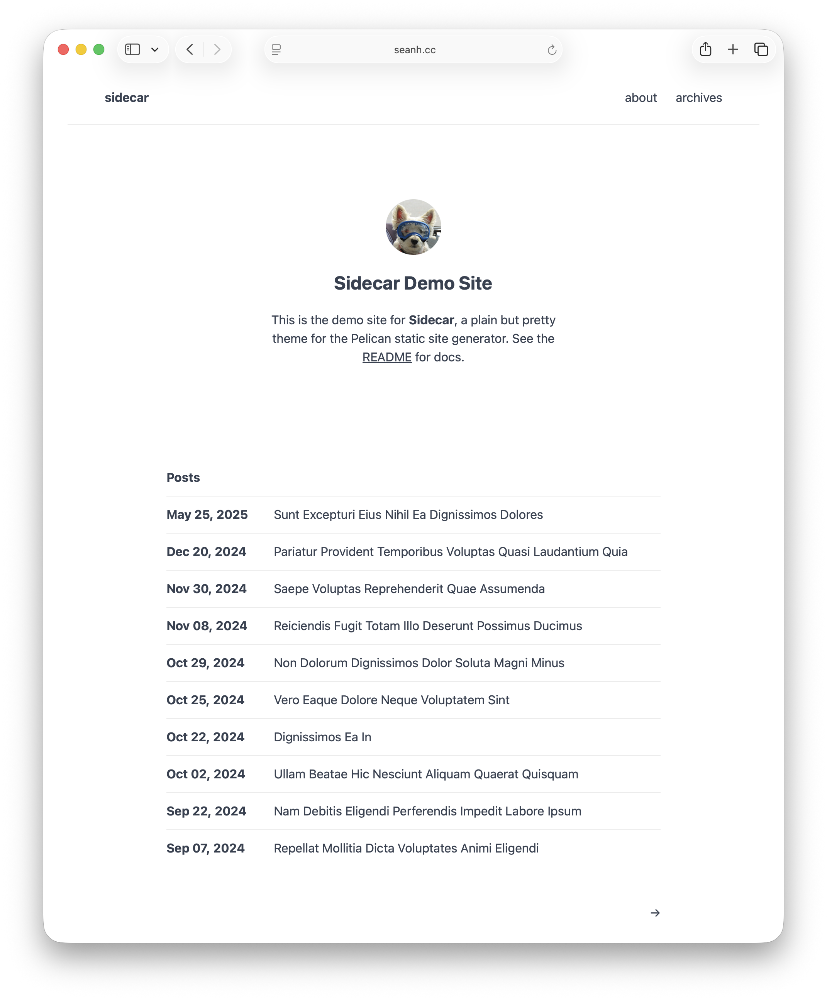

Sidecar
=======

A plain but pretty theme for the [Pelican](https://getpelican.com/) static site
generator. [Demo site](https://www.seanh.cc/sidecar/).



Features
--------

* **Nice typography** and a wide range of HTML elements you can use in pages and articles.
  Sidecar is based on **Oatcake**, my universal CSS typography theme.
  See [Oatcake's site](https://www.seanh.cc/oatcake/) for documentation:
  anything you see on that page, you can use in your pages and articles with Sidecar.
  The dummy articles on Sidecar's demo site show [some of the elements in action](https://www.seanh.cc/sidecar/2025/05/25/sunt-excepturi-eius-nihil-ea-dignissimos-dolores/).
* **Responsive design**: works great on both desktop and mobile.
* **Customizable colors, fonts, and elements**, both [site-wide](#custom_css) and [per-page/article](#custom_article_css) styles.
* **Code blocks with syntax highlighting**.
  Use the [`SIDECAR_PYGMENTS_THEME`](#sidecar_pygments_theme) setting to choose
  from a few dozen builtin syntax highlighting color themes.
* **Automatically generated [tables of contents](#tables-of-contents)** for pages and articles.
* **A customizable navbar** with the [`SIDECAR_NAVBAR`](#sidecar_navbar) setting.
* **Customizable article taglines** with the [`SIDECAR_TAGLINE`](#sidecar_tagline) setting.
* **Supports Pelican's Atom and RSS feeds** with feed autodiscovery links in the HTML `<head>`.
* **Supports all of Pelican's pages:**
  the [index page](https://www.seanh.cc/sidecar/),
  article pages ([example](https://www.seanh.cc/sidecar/2025/05/25/sunt-excepturi-eius-nihil-ea-dignissimos-dolores/)),
  static pages ([example](https://www.seanh.cc/sidecar/about/)),
  the [archives page](https://www.seanh.cc/sidecar/archives/),
  [authors](https://www.seanh.cc/sidecar/authors/),
  [categories](https://www.seanh.cc/sidecar/categories/),
  [tags](https://www.seanh.cc/sidecar/tags/),
  and period archives (for example:
  [all articles from 2024](https://www.seanh.cc/sidecar/2024/),
  [all articles from January 2024](https://www.seanh.cc/sidecar/2024/01/), or
  [all articles from 26th January 2024](https://www.seanh.cc/sidecar/2024/01/26/)).
* **Uses semantic HTML** including:
  the `<html>` element's `lang` attribute for the site's default language (the [`DEFAULT_LANG`](#DEFAULT_LANG) setting) or the page/article's language;
  `<header>` for the site header;
  `<nav>` for the navbar;
  `<main>` for the page's main content;
  `<hgroup>` to group headings and subheadings together;
  `<footer>` for page and article taglines and footers;
  link relations:
  `rel="bookmark"` for article permalinks,
  `rel="author"` for article and page authors,
  `rel="tag"` for tags,
  `rel="next"` and `rel="prev"` for pagination links;
  `<time>` elements with the `datetime` attribute for article/page created/updated dates;
  links have helpful tooltips with the `title` attribute;
  and pages have good tab titles with the `<title>` element.

Installation
------------

1. Clone the theme to a local directory:

   ```terminal
   git clone https://github.com/seanh/sidecar.git
   ```

2. Set the [`THEME`](https://docs.getpelican.com/en/latest/settings.html#THEME)
   setting in your Pelican config to the path to your local clone of Sidecar.
   It can be either an absolute path or a path relative to your Pelican config
   file:

   ```python
   # pelicanconf.py

   THEME = "../sidecar"
   ```

Usage
-----

### Summaries

Sidecar supports optional article and page "summaries" (or "subtitles" /
"subheadings") that're displayed in large-text beneath the article or page's
title.
See this demo post for [an example of an article with a summary](https://www.seanh.cc/sidecar/2025/05/25/sunt-excepturi-eius-nihil-ea-dignissimos-dolores/).

You create a summary by adding a `Summary` to your article or page's metadata, like this:

<pre><code>Title: Example Post Title
<mark>Summary: Lorem ipsum dolor sit amet, consectetur adipiscing elit. Proin a malesuada orci.</mark>

Nullam at massa eros. Nullam ultricies suscipit volutpat.
Maecenas at elit quis sem semper rutrum eu condimentum lorem&hellip;</code></pre>

You can also use `Subtitle` or `Subheading` instead of `Summary`. The difference
is that if you use `Summary` Pelican will also use the provided summary in its
RSS and Atom feeds (overriding the default summary that Pelican generates from
your article's body), whereas if you use `Subtitle` or `Subheading` this will
not replace the article summary in RSS and Atom feeds.

Markdown syntax works in `Summary` fields by default, but not in `Subtitle`
or `Subheading` fields. To get Markdown to work in `Subtitle` or `Subheading`
fields add them to the `FORMATTED_FIELDS` setting in your Pelican config:

```python
# pelicanconf.py

FORMATTED_FIELDS = ["summary", "subheading", "subtitle"]
```

Python-Markdown doesn't allow blank lines in metadata, so to create a
multi-paragraph summary you need to use `<p>`'s:

```
Title: About
Summary:
    <p>
      Sidecar is a plain but pretty theme for the Pelican static site generator
      that works great on both mobile and desktop.
    </p>
    <p markdown="1">
      This *About* page is an example of what a static page looks like
      with Sidecar.
    </p>
```

(The `markdown="1"` is needed to enable Markdown syntax within a `<p>`.)

You can also add subheadings to `<h2>` or `<h3>` headings within article or page
bodies by wrapping the `<h2>` or `<h3>` in an `<hgroup>` along with one or more
`<p>`'s above and/or below the heading, like this:

```html
<hgroup>
  <h2>The reality dysfunction</h2>
  <p>Space is not the only void</p>
</hgroup>
```

### Tables of contents

Sidecar uses [Tocbot](https://tscanlin.github.io/tocbot/) to generate tables of
contents with anchor links from [AnchorJS](https://www.bryanbraun.com/anchorjs/).
I prefer this approach rather than using a Pelican plugin or Markdown extension
to generate tables of contents because it's portable to other site generators
and even to static HTML: just include AnchorJS and Tocbot in your pages and your
tables of contents will work.

Insert a `<div>` with the CSS class `toc` anywhere in a page or article and
it'll be turned into a table of contents based on the page or article's headers:

```html
<!-- Tocbot will turn this div into a table of contents. -->
<div class="toc"></div>
```

If you want to omit a particular heading from the table of contents add the CSS
class `notoc` to it:

```html
<h2 class="notoc">Heading</h2>
```

#### Anchor links

The table of contents depends on all your headings having `id` attributes for anchor links.
Sidecar uses AnchorJS to automatically generate `id`'s for all your headings,
with the `id` values based on the contents of the headings.
If you want to control a heading's `id` value yourself (for example so it
doesn't change if you re-word the heading), add an `id` attribute manually as
normal and AnchorJS will use it instead of generating its own:

```html
<h2 id="my-heading">My Heading</h2>
```

If you don't want a heading to have an anchor link, add the CSS class `noanchor`
to it (this will also remove the heading from the table of contents):

```html
<h2 class="noanchor">Heading</h2>
```

<h3 id="custom_article_css">Per-page custom styles</h3>

You can add site-wide custom CSS to Sidecar using the
[`STYLESHEET_URL`](#stylesheet_url) and [`STYLESHEET`](#stylesheet) settings.
To add _per-page_ or _per-article_ CSS add a `Stylesheet` line to a page
or article's metadata, this way you can style different pages and articles
differently from each other:

<pre><code>Title: A Page or Article with a Custom Stylesheet
<mark>Stylesheet:
    :root {
      --ok-color-bg: #ff851b;
      --ok-color-fg: #85144b;
    }</mark>

Lorem ipsum dolor sit amet, consectetur adipiscing elit&hellip;</code></pre>

### Modification dates

If you add a `Modified` date to an article's metadata it'll be shown in the
article's tagline as its "updated" date (as long as you have `"TIME"` in your
[`SIDECAR_TAGLINE`](#sidecar_tagline) setting):

<pre><code>Title: My Article
Date: 2015-11-12
<mark>Modified: 2015-12-05</mark></code></pre>

You can see an example in [this dummy article](https://www.seanh.cc/sidecar/2021/02/16/etiam-elementum-nibh-vel-tincidunt-auctor/).

_Static pages_ don't show any created or updated date by default, but if you add
a `Modified` date to a static page's metadata it'll be shown at the bottom of
the page as "Last updated".

Settings
--------

### `SITEURL`

You **must** set this to the base URL of your site with no trailing slash.
It's used to generate URLs in feeds, links in the navbar, etc.

```python
# pelicanconf.py

SITEURL = "http://blog.notmyidea.org"
```

### `ANALYTICS`

Put any desired analytics scripts in this setting. Example:

```python
# pelicanconf.py

ANALYTICS = """
    <script src="/theme/js/primary-analytics.js"></script>
    <script>
        [ … in-line Javascript code for secondary analytics … ]
    </script>
"""
```

### `DEFAULT_DATE_FORMAT`

The format to use for page and article dates in [Python `strftime` format](https://docs.python.org/3/library/datetime.html#strftime-and-strptime-format-codes).

```python
# pelicanconf.py

DEFAULT_DATE_FORMAT = "%-d %B, %Y"
```

### `DEFAULT_LANG`

Your site's default language, used for the standard `lang` attribute on the
root `<html>` element. If not set this defaults to `"en"`.

```python
# pelicanconf.py

DEFAULT_LANG = "en"
```

### `DEFAULT_PAGINATION`

The maximum number of articles to show per-page, on paginated pages.
Set to `False` to disable pagination and show all articles on one page.
See [Pelican's docs on pagination](https://docs.getpelican.com/en/latest/settings.html#pagination).

```python
# pelicanconf.py

DEFAULT_PAGINATION = 10
```

### `DISPLAY_PAGES_ON_MENU`

Set this to `True` to add links to each of your site's static pages to the navbar.
If [`SIDECAR_NAVBAR`](#sidecar_navbar) is set it overrides this setting.

```python
# pelicanconf.py

DISPLAY_PAGES_ON_MENU = True
```

### `GITHUB_URL`

If `GITHUB_URL` is set in your Pelican config then a GitHub icon linking to
`GITHUB_URL` will be added to your site's navbar. The idea is that you set
`GITHUB_URL` to your GitHub profile page:

```python
# pelicanconf.py

GITHUB_URL = "https://github.com/seanh"
```

### `SIDECAR_SEARCH`

Set this to `False` to remove the search bar from the archives page:

```python
# pelicanconf.py

SIDECAR_SEARCH = False
```

### `SITENAME`

Sets the name of your site in tab and feed titles:

```python
# pelicanconf.py

SITENAME = "A Pelican Blog"
```

### Avatar and bio: `AVATAR_URL`, `SITESUBTITLE` and `SITEBIO`

Sidecar's front page includes an optional "bio" section with an avatar
image, site subtitle, and bio text. To make this appear add the `AVATAR_URL`,
`SITESUBTITLE` and `SITEBIO` settings to your Pelican config. You can omit any
one of these settings and its corresponding element will be omitted from the
bio.

```python
# pelicanconf.py

AVATAR_URL = "https://gravatar.com/avatar/bfda7359103e3879e16f65bed41ce848fb8c2e9ea44822fc7469984c19cb1902?s=72"
SITESUBTITLE = "I blog, you blog, weblog."
SITEBIO = '''Hi 👋, I'm <a rel="author" href="{SITEURL}/about/">Sean</a>, a developer and future Portuguese Water Dog owner living in <s>Berlin</s>, <s>Edinburgh</s>.'''
```

<h3 id="sidecar_pygments_theme">Syntax highlighting: <code>SIDECAR_PYGMENTS_THEME</code></h3>

Sidecar supports code blocks with syntax highlighting.
See [Syntax highlighting](https://docs.getpelican.com/en/latest/content.html#syntax-highlighting)
in Pelican's docs, and see the Pygments site for the list of available [language names](https://pygments.org/languages/).

There are several ways to create syntax-highlighted code blocks but I recommend
the "fenced code block" style because it also works on GitHub:

    ```python
    def hello_world():
        print("Hello, world!")
    ```

You can add `hl_lines` to highlight certain lines with the code block:

    ```python hl_lines="1 3"
    def hello_world():
        print("Hello, world!")
    ```

You can set your syntax highlighting color scheme with the `SIDECAR_PYGMENTS_THEME` setting:

```python
# pelicanconf.py

SIDECAR_PYGMENTS_THEME = "monokai"
```

See this folder for [all the available themes](https://github.com/seanh/sidecar/tree/main/static/css/pygments)
and see the Pygments site for [previews of all the themes](https://pygments.org/styles/).

Set `SIDECAR_PYGMENTS_BORDERLESS = True` to remove the border from code blocks:

```python
# pelicanconf.py

SIDECAR_PYGMENTS_BORDERLESS = True
```

<h3 id="custom_css">Customizing Sidecar's colors, fonts, and CSS: <code>STYLESHEET</code> and <code>STYLESHEET_URL</code></h3>

Oatcake provides several CSS variables for customizing the colors, fonts, etc.
See [Oatcake's site](https://www.seanh.cc/oatcake/) for docs.
You can use the `STYLESHEET` and `STYLESHEET_URL` settings to inject your own
site-wide CSS that changes these variables or just adds arbitrary CSS rules.
You can also inject [per-page/article CSS](#custom_article_css).
Both Oatcake and Sidecar use [CSS layers](https://developer.mozilla.org/en-US/docs/Web/CSS/Reference/At-rules/@layer)
so your own custom CSS rules will take precedence regardless of specificity.

#### `STYLESHEET`

Just set `STYLESHEET` in your Pelican config to some custom CSS:

```python
# pelicanconf.py

STYLESHEET = """
    :root {
      --ok-color-bg: #ff851b;
      --ok-color-fg: #85144b;
    }
"""
```

#### `STYLESHEET_URL`

First, add a CSS stylesheet to your site as [static content](https://docs.getpelican.com/en/latest/content.html#static-content)
then set `STYLESHEET_URL` to its URL, for example:

```python
# pelicanconf.py

STYLESHEET_URL = "css/stylesheet.css"
```

<h3 id="sidecar_navbar">Customizing the navbar with <code>SIDECAR_NAVBAR</code></h3>

You can customize the contents of the navbar by adding a `SIDECAR_NAVBAR`
setting (list of strings) to your Pelican config. For example:

```python
# pelicanconf.py

SIDECAR_NAVBAR = [
    "HOME",
    "SPACE",
    "MENUITEMS",
    "PAGES",
    "CATEGORIES",
    "TAGS",
    "AUTHORS",
    "ARCHIVES",
    '<a rel="external" href="https://example.com">Custom Link</a>',
]
```

Certain string values have special meanings in `SIDECAR_NAVBAR`:

* `HOME`: inserts a link to your site's home page (uses Pelican's [`SITEURL`](https://docs.getpelican.com/en/latest/settings.html#SITEURL) and [`SITENAME`](https://docs.getpelican.com/en/latest/settings.html#SITENAME) settings).

* `SPACE`: inserts a flexible space. All items after a `SPACE` will be right-aligned rather than left-aligned.

* `MENUITEMS`: inserts the items from Pelican's [`MENUITEMS` setting](https://docs.getpelican.com/en/latest/settings.html#MENUITEMS).

* `PAGES`: inserts links to each of your site's static pages.

* `CATEGORIES`: inserts a link to your site's categories page.

  For this to work you must add matching `CATEGORIES_SAVE_AS`
  and `CATEGORIES_URL` settings to your Pelican config.
  For example:

  ```python
  # pelicanconf.py

  CATEGORIES_SAVE_AS = "categories/index.html"
  CATEGORIES_URL = "categories/"
  ```

* `TAGS`: inserts a link to your site's tags page.

  For this to work you must add matching `TAGS_SAVE_AS`
  and `TAGS_URL` settings to your Pelican config.
  For example:

  ```python
  # pelicanconf.py

  TAGS_SAVE_AS = "tags/index.html"
  TAGS_URL = "tags/"
  ```

* `AUTHORS`: inserts a link to your site's authors page.

  For this to work you must add matching `AUTHORS_SAVE_AS`
  and `AUTHORS_URL` settings to your Pelican config.
  For example:

  ```python
  # pelicanconf.py

  AUTHORS_SAVE_AS = "authors/index.html"
  AUTHORS_URL = "authors/"
  ```

* `ARCHIVES`: inserts a link to your site's archives page.

  For this to work you must add matching `ARCHIVES_SAVE_AS`
  and `ARCHIVES_URL` settings to your Pelican config.
  For example:

  ```python
  # pelicanconf.py

  ARCHIVES_SAVE_AS = "archives/index.html"
  ARCHIVES_URL = "archives/"
  ```

Items in `SIDECAR_NAVBAR` that don't match any of the special strings above are
rendered directly. This lets you include your own raw HTML strings as menu
items. For example, you could include a custom link. This lets you use HTML
attributes other than `href` in your navbar links, which you can't do with
Pelican's `MENUITEMS`:

```python
# pelicanconf.py

SIDECAR_NAVBAR = [
    ...
    '<a rel="external" href="https://example.com">Custom Link</a>',
    '<a rel="license" href="{SITEURL}/license/">License</a>',
]
```

`{SITEURL}` in menu item strings will be replaced with Pelican's
[`SITEURL` setting](https://docs.getpelican.com/en/latest/settings.html#SITEURL).

<h3 id="sidecar_tagline">Customizing article and page taglines with <code>SIDECAR_TAGLINE</code></h3>

You can customize the contents of the taglines above article titles by
adding a `SIDECAR_TAGLINE` setting (list of strings) to your Pelican
config. For example:

```python
# pelicanconf.py

SIDECAR_TAGLINE = [
    "AUTHORS",
    "TIME",
    "SOURCE",
    "TAGS",
]
```

Certain string values have special meanings in `SIDECAR_TAGLINE`:

* `AUTHORS`: insert links to Pelican's author pages for the article's authors.

* `TIME`: inserts the article's publication date/time.

  You can customize the format of dates with Pelican's [`DEFAULT_DATE_FORMAT` and `DATE_FORMATS` settings](https://docs.getpelican.com/en/latest/settings.html#time-and-date).

* `SOURCE`: inserts a link to the article's plain text source file, if [Pelican's `OUTPUT_SOURCES` setting](https://docs.getpelican.com/en/latest/settings.html#OUTPUT_SOURCES) is enabled.

  If you've changed Pelican's `ARTICLE_SAVE_AS` and `ARTICLE_URL` settings from
  the defaults then you need to add an `ARTICLE_SOURCE_URL` setting to your
  Pelican config to tell Sidecar how to generate the URLs to your article
  source files. See [`ARTICLE_SOURCE_URL` and `PAGE_SOURCE_URL`](#article_source_url).

* `CATEGORY`: inserts a link to Pelican's category page for the article's category.

* `TAGS`: inserts links to Pelican's tag pages for each of the article's tags, if any.

Items in `SIDECAR_TAGLINE` that don't match any of the special strings
above are rendered directly, so you can include your own raw HTML strings in
taglines.

<h3 id="article_source_url">Linking to article/page source files</h3>

If [Pelican's `OUTPUT_SOURCES` setting](https://docs.getpelican.com/en/latest/settings.html#OUTPUT_SOURCES)
is enabled Pelican includes the plaintext source files (e.g. Markdown files) of
your articles and pages in your site.

On article and static pages, if `OUTPUT_SOURCES` is enabled, Sidecar inserts a
link to the article or page's plain text source file into the HTML `<head>`
(using `<link rel="alternate" type="text/plain" href="...">`).

Source links can also be included in article taglines by including `"SOURCE"` in
the [`SIDECAR_TAGLINE`](#sidecar_tagline) setting.

If you've changed [Pelican's `ARTICLE_SAVE_AS` and `ARTICLE_URL` or `PAGE_SAVE_AS` and `PAGE_URL` settings](https://docs.getpelican.com/en/latest/settings.html#url-settings)
from the defaults then you need to add `ARTICLE_SOURCE_URL` and
`PAGE_SOURCE_URL` settings to your Pelican config to tell Sidecar how to
generate the URLs to your article and page source files. For example:

```python
# pelicanconf.py

ARTICLE_SAVE_AS = '{date:%Y}/{date:%m}/{date:%d}/{slug}/index.html'
ARTICLE_URL = '{date:%Y}/{date:%m}/{date:%d}/{slug}/'
ARTICLE_SOURCE_URL = "{article.url}index{OUTPUT_SOURCES_EXTENSION}"

PAGE_SAVE_AS = '{slug}/index.html'
PAGE_URL = '{slug}/'
PAGE_SOURCE_URL = "{page.url}index{OUTPUT_SOURCES_EXTENSION}"
```
