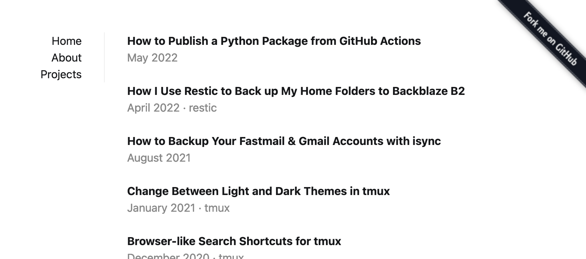

Sidecar
=======

A plain but pretty [Pelican](https://getpelican.com/) theme based on [Oatcake](https://github.com/seanh/oatcake).




Features
--------

* **Nice-looking text** with lots of extra typographical features.

  Sidecar uses Oatcake, my CSS typography stylesheet.
  See [Oatcake's site](https://www.seanh.cc/oatcake/) for all the details.

* **Responsive design**: works great on both desktop and mobile.

* **Supports most of Pelican's features**:
  all the different pages (static pages, archives and period archives, category and categories pages, tag and tags pages, author and authors pages),
  syntax highlighting,
  Atom and RSS feeds (with feed autodiscovery links in the HTML `<head>`),
  pagination.
  Also responds to many of Pelican's default settings (see [Settings](#settings) below).

  Support for a couple of Pelican features is still missing, including
  [translations](https://github.com/seanh/sidecar/issues/1)
  and [author, category and tag feeds](https://github.com/seanh/sidecar/issues/18).

* **Standard, semantic HTML**:
  `<main>` for the main content of pages,
  `<article>` for articles,
  `<hgroup>` to group article titles and subheadings,
  `<footer>` for footers,
  `<time>` for article publication dates,
  `rel="author"` for article author links,
  `rel="bookmark"` for article permalinks,
  `rel="tag"` for tag links,
  `rel="next"` and `rel="prev"` for pagination links,
  `aria-current="page"` for the link to the current page in the navbar,
  etc.
  Links have nice `title` attributes for tooltips.
  Pages have nice `<title>` elements for tab titles.

* Optional [tables of contents](#tables-of-contents) for static pages and articles.

* Customizable navbar and article footer contents with the
  [`SIDECAR_NAVBAR`](#sidecar_navbar)
  and [`SIDECAR_ARTICLE_FOOTER`](#sidecar_article_footer)
  settings.


Usage
-----

1. Clone the theme to a local directory:

   ```terminal
   $ git clone https://github.com/seanh/sidecar.git
   ```

2. Set the [`THEME`](https://docs.getpelican.com/en/latest/settings.html#THEME)
   setting in your Pelican config to the path to your local clone of Sidecar.
   It can be either an absolute path or a path relative to your Pelican config
   file:

   ```python
   # pelicanconf.py

   THEME = "../sidecar"
   ```

Tables of contents
------------------

Sidecar uses [Tocbot](https://tscanlin.github.io/tocbot/) to generate tables of
contents with anchor links from
[AnchorJS](https://www.bryanbraun.com/anchorjs/).
I prefer this approach rather than using a Pelican plugin or Markdown extension
to generate tables of contents because it's portable to other site generators:
just include AnchorJS and Tocbot in your pages and your tables of contents will
work.

Insert a div with the CSS class `toc` anywhere in a page or article and it'll
be turned into a table of contents based on the page or article's headers:

```html
<!-- Tocbot will turn this div into a table of contents. -->
<div class="toc"></div>
```

If you want to omit a particular heading from the table of contents add the CSS
class `notoc` to it:

```html
<h1 class="notoc">Heading</h1>
```

If you don't want a heading to have an anchor link either, add `noanchor` to it
(this will also remove the heading from the table of contents):

```html
<h1 class="noanchor">Heading</h1>
```

Settings
--------

### `ANALYTICS`

Put any desired analytics scripts in this setting
(it's the same as [Pelican's built-in `notmyidea` theme's `ANALYTICS` setting](https://docs.getpelican.com/en/latest/settings.html#ANALYTICS).
Example:

```python
ANALYTICS = """
    <script src="/theme/js/primary-analytics.js"></script>
    <script>
        [ … in-line Javascript code for secondary analytics … ]
    </script>
"""
```

### `SITENAME`

Sets the name of your site in tab and feed titles:

```python
# pelicanconf.py

SITENAME = "A Pelican Blog"
```

### `SITEURL`

You must set this to the base URL of your site with no trailing slash.
It's used to generate URLs in feeds, links in the navbar, etc.

```python
# pelicanconf.py

SITEURL = "http://blog.notmyidea.org"
```

### `DEFAULT_LANG`

Your site's default language, used for the standard `lang` attribute on the
root `<html>` element. If not set this defaults to `"en"`.

```python
# pelicanconf.py

DEFAULT_LANG = "en"
```

### `STYLESHEET_URL`

Add your own stylesheet after Sidecar's so you can customize the CSS.

First, add a CSS stylesheet to your site as [static content](https://docs.getpelican.com/en/latest/content.html#static-content)
then set `STYLESHEET_URL` to its URL, for example:

```python
# pelicanconf.py

STYLESHEET_URL = "css/stylesheet.css"
```

### `ARTICLE_SOURCE_URL` and `PAGE_SOURCE_URL`

If [Pelican's `OUTPUT_SOURCES` setting](https://docs.getpelican.com/en/latest/settings.html#basic-settings)
is enabled Pelican copies the plain text source files of
your articles and pages into your site's output directory.

On article and static pages, if `OUTPUT_SOURCES` is enabled, Sidecar inserts a
link to the article or page's plain text source file into the HTML `<head>`
(using `<link rel="alternate" type="text/plain" href="...">`).

If you've changed [Pelican's `ARTICLE_SAVE_AS` and `ARTICLE_URL` or `PAGE_SAVE_AS` and `PAGE_URL` settings](https://docs.getpelican.com/en/latest/settings.html#url-settings)
from the defaults then you need to add `ARTICLE_SOURCE_URL` and
`PAGE_SOURCE_URL` settings to your Pelican config to tell Sidecar how to
generate the URLs to your article and page source files. For example:

  ```python
  # pelicanconf.py

  ARTICLE_SAVE_AS = '{date:%Y}/{date:%m}/{date:%d}/{slug}/index.html'
  ARTICLE_URL = '{date:%Y}/{date:%m}/{date:%d}/{slug}/'
  ARTICLE_SOURCE_URL = "{article.url}index{OUTPUT_SOURCES_EXTENSION}"

  PAGE_SAVE_AS = '{slug}/index.html'
  PAGE_URL = '{slug}/'
  PAGE_SOURCE_URL = "{page.url}index{OUTPUT_SOURCES_EXTENSION}"
  ```

### `GITHUB_URL`

If Pelican's [`GITHUB_URL`](https://docs.getpelican.com/en/latest/settings.html#GITHUB_URL)
setting is set in your Pelican config then a GitHub icon linking to `GITHUB_URL`
will be added to your site's navbar. The idea is that you set `GITHUB_URL` to
your GitHub profile page. For example:

```python
# pelicanconf.py

GITHUB_URL = "https://github.com/seanh"
```

### `SIDECAR_NAVBAR`

You can customize the contents of the navbar by adding a `SIDECAR_NAVBAR`
setting (list of strings) to your Pelican config. For example:

```python
# pelicanconf.py

SIDECAR_NAVBAR = [
    "HOME",
    "SPACE",
    "MENUITEMS",
    "PAGES",
    "CATEGORIES",
    "TAGS",
    "AUTHORS",
    "ARCHIVES",
    '<a rel="external" href="https://example.com">Custom Link</a>',
]
```

Certain string values have special meanings in `SIDECAR_NAVBAR`:

* `HOME`: inserts a link to your site's home page (uses Pelican's [`SITEURL`](https://docs.getpelican.com/en/latest/settings.html#SITEURL) and [`SITENAME`](https://docs.getpelican.com/en/latest/settings.html#SITENAME) settings).

* `SPACE`: inserts a flexible space. All items after a `SPACE` will be right-aligned rather than left-aligned.

* `MENUITEMS`: inserts the items from Pelican's [`MENUITEMS` setting](https://docs.getpelican.com/en/latest/settings.html#MENUITEMS).

* `PAGES`: inserts links to each of your site's static pages.

* `CATEGORIES`: inserts a link to your site's categories page.

  For this to work you must add matching `CATEGORIES_SAVE_AS`
  and `CATEGORIES_URL` settings to your Pelican config.
  For example:

  ```python
  # pelicanconf.py

  CATEGORIES_SAVE_AS = "categories/index.html"
  CATEGORIES_URL = "categories/"
  ```

* `TAGS`: inserts a link to your site's tags page.

  For this to work you must add matching `TAGS_SAVE_AS`
  and `TAGS_URL` settings to your Pelican config.
  For example:

  ```python
  # pelicanconf.py

  TAGS_SAVE_AS = "tags/index.html"
  TAGS_URL = "tags/"
  ```

* `AUTHORS`: inserts a link to your site's authors page.

  For this to work you must add matching `AUTHORS_SAVE_AS`
  and `AUTHORS_URL` settings to your Pelican config.
  For example:

  ```python
  # pelicanconf.py

  AUTHORS_SAVE_AS = "authors/index.html"
  AUTHORS_URL = "authors/"
  ```

* `ARCHIVES`: inserts a link to your site's archives page.

  For this to work you must add matching `ARCHIVES_SAVE_AS`
  and `ARCHIVES_URL` settings to your Pelican config.
  For example:

  ```python
  # pelicanconf.py

  ARCHIVES_SAVE_AS = "archives/index.html"
  ARCHIVES_URL = "archives/"
  ```

Items in `SIDECAR_NAVBAR` that don't match any of the special strings above are
rendered directly. This lets you include your own raw HTML strings as menu
items. For example you could include a custom link. This lets you use HTML
attributes other than `href` in your navbar links, which you can't do with
Pelican's `MENUITEMS`:

```python
# pelicanconf.py

SIDECAR_NAVBAR = [
    ...
    '<a rel="external" href="https://example.com">Custom Link</a>',
    '<a rel="license" href="{SITEURL}/license/">License</a>',
]
```

`{SITEURL}` in menu item strings will be replaced with Pelican's
[`SITEURL` setting](https://docs.getpelican.com/en/latest/settings.html#SITEURL).

### `SIDECAR_ARTICLE_FOOTER`

You can customize the contents of the footers beneath article titles by
adding a `SIDECAR_ARTICLE_FOOTER` setting (list of strings) to your Pelican
config. For example:

```python
# pelicanconf.py

SIDECAR_ARTICLE_FOOTER = [
    "AUTHORS",
    "TIME",
    "SOURCE",
    "TAGS",
]
```

Certain string values have special meanings in `SIDECAR_ARTICLE_FOOTER`:

* `AUTHORS`: insert links to Pelican's author pages for the article's authors.

* `TIME`: inserts the article's publication date/time.

  You can customize the format of dates with Pelican's [`DEFAULT_DATE_FORMAT` and `DATE_FORMATS` settings](https://docs.getpelican.com/en/latest/settings.html#time-and-date).

* `SOURCE`: inserts a link to the article's plain text source file, if [Pelican's `OUTPUT_SOURCES` setting](https://docs.getpelican.com/en/latest/settings.html#basic-settings) is enabled.

  If you've changed Pelican's `ARTICLE_SAVE_AS` and `ARTICLE_URL` settings from
  the defaults then you need to add an `ARTICLE_SOURCE_URL` setting to your
  Pelican config to tell Sidecar how to generate the URLs to your article
  source files. See [`ARTICLE_SOURCE_URL` and `PAGE_SOURCE_URL`](#article_source_url-and-page_source_url) above.

* `CATEGORY`: inserts a link to Pelican's category page for the article's category.

* `TAGS`: inserts links to Pelican's tag pages for each of the article's tags, if any.

Items in `SIDECAR_ARTICLE_FOOTER` that don't match any of the special strings
above are rendered directly, so you can include your own raw HTML strings in
footers.

Customizing the templates
-------------------------

### Moving the archive page to the home page

Some people like to use the archive page as the home page of their site:
showing only the titles of posts on the home page (no summaries) and listing
all post titles on one long page (no pagination).

You can do this in your Pelican config file just by telling Pelican not to
render the index page (the normal home page) and telling it write the archives
page to the root `/index.html` file where the index page would normally be:

```python
# pelicanconf.py

# Use the archives page as the home page.
INDEX_SAVE_AS = ""
ARCHIVES_SAVE_AS = "index.html"
```

You can use a similar trick to use a static page as your home page,
see [How can I use a static page as my home page?](https://docs.getpelican.com/en/latest/faq.html#how-can-i-use-a-static-page-as-my-home-page)
in Pelican's docs.

### Overriding templates

You can use Pelican's [`THEME_TEMPLATE_OVERRIDES`](https://docs.getpelican.com/en/latest/settings.html#themes)
setting to override individual templates from the Sidecar theme.

Set `THEME_TEMPLATE_OVERRIDES` to a folder (path relative to your Pelican config file):

```python
# pelicanconf.py

# Override individual templates from the theme.
THEME_TEMPLATES_OVERRIDES = ["theme_template_overrides"]
```

Now to replace the front page with your own custom
[Jinja](https://jinja.palletsprojects.com/) template, create a
`theme_template_overrides/index.html` file:

```jinja2
{# theme_template_overrides/index.html #}

<h1>My Custom Home Page</h1>
```

Read Jinja's [Template Designer Documentation](https://jinja.palletsprojects.com/en/3.1.x/templates/)
to learn how to write Jinja templates, and Pelican's
[Themes](https://docs.getpelican.com/en/latest/themes.html) page to see what
variables are available to each template.

Template overrides can use Jinja's `` to extend Sidecar's base
templates. This can be an alternative way to replace the home page with the
archives page:

```jinja2
{# theme_template_overrides/index.html #}


```

You'll probably also want to disable generation of the archives page, since
you've turned the home page into an archives page:

```python
# pelicanconf.py

# Disable generation of the archives page.
ARCHIVES_SAVE_AS = ""
```

When extending a template you can use Jinja's `` to replace specific
parts of the base template. `{{ super() }}` can also be useful. See
[Template Inheritance](https://jinja.palletsprojects.com/en/3.1.x/templates/#template-inheritance)
in Jinja's docs for details.

For example the archives page has the title **Archive** at the top of the page,
and also in the tab title. You might not want that title if you're using the
archives page as your home page. Fortunately the `archives.html` template
provides a `title` and `content_title` blocks that you can use to override the
tab title and in-page title:

```jinja2
{# theme_template_overrides/index.html #}



My Blog - Home Page

My Blog
```

To remove the content title entirely just use an empty block:

```jinja2

```

Take a look at [Sidecar's templates](https://github.com/seanh/sidecar/tree/main/templates)
to see what template files are available for overriding, and look for ``
definitions in the template files to see what blocks are available for
overriding when extending each template.

Lastly, Sidecar provides a collection of [include templates](https://github.com/seanh/sidecar/tree/main/templates/includes)
that you can call from your custom templates by using Jinja's [``](https://jinja.palletsprojects.com/en/3.1.x/templates/#include).
Also see [Inheritance](https://docs.getpelican.com/en/latest/themes.html#inheritance) in Pelican's docs.
For example there's an `article/archives.html` include which Sidecar's default
archives page uses to render each article: the include renders just the
article's title and footer. This can be a third way to replace the articles on
your front page with only their titles:

```jinja2
{# theme_template_overrides/index.html #}




  
    
  

```
